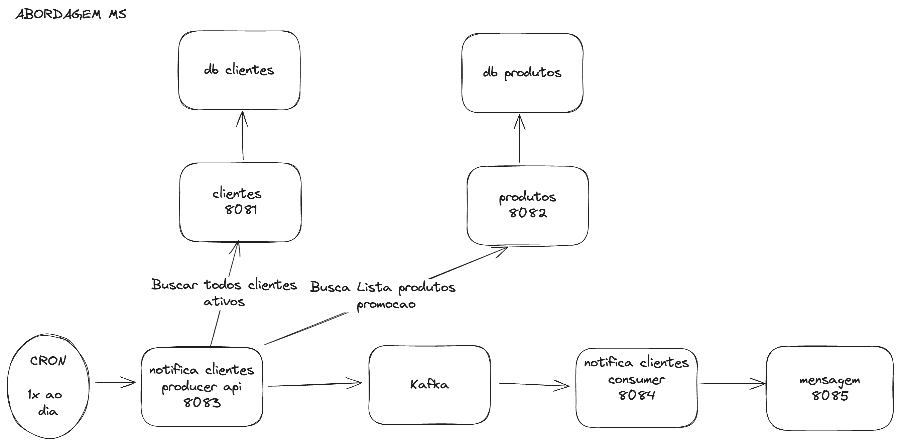

# ds-store

Desenho de arquitetura / system design

# Dados técnicos
- Tecnologias: Java20 , Springboot
- Abordagem arquitetura: Arquitetura em camadas
- Arquitetura: Microservices 
- Build: Gradle

# Servicos
- api-clientes 8081 :
- api-produtos 8082 :
- api-notifica-producer 8083 :
- infra-kafka :
- api-notifica-consumer 8084 :
- api-mensagem 8085 : 

# Testes 
- e2e: postman 
- unitario: junit